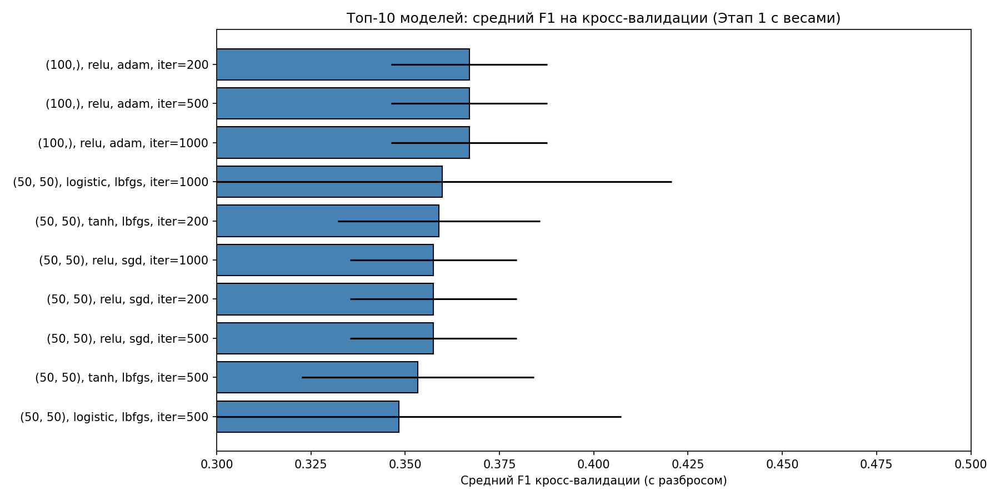
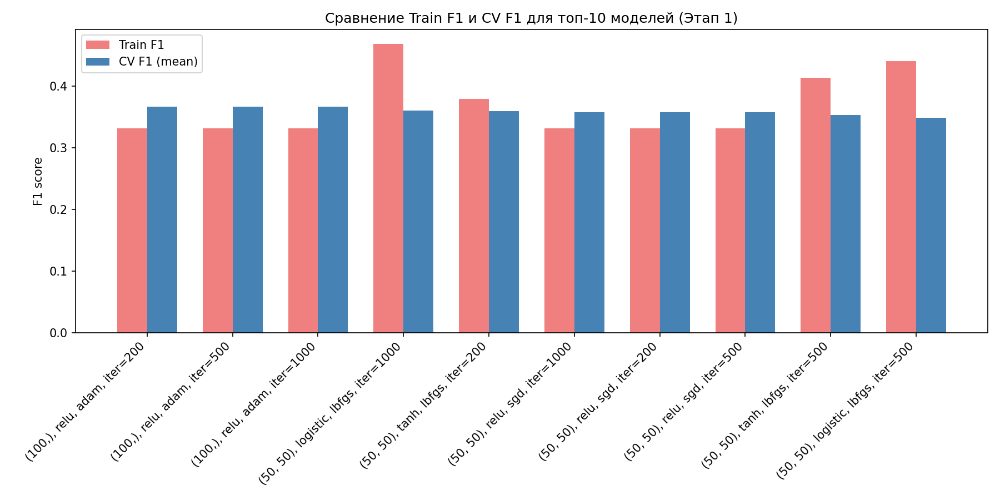
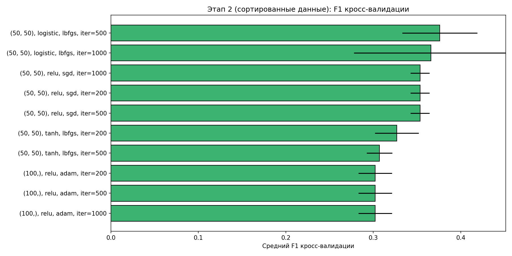
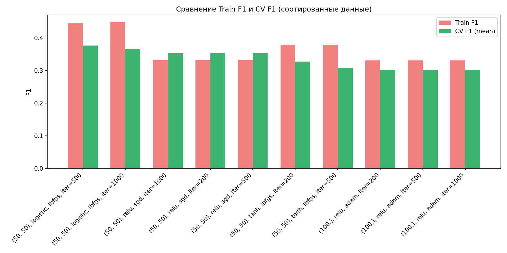
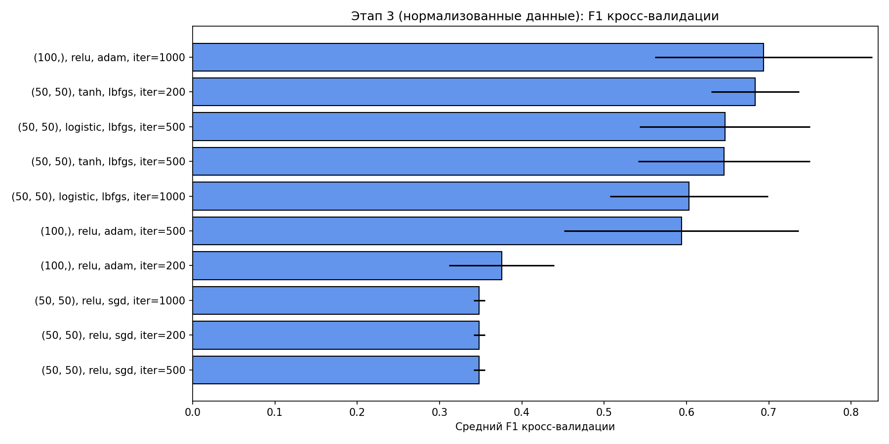
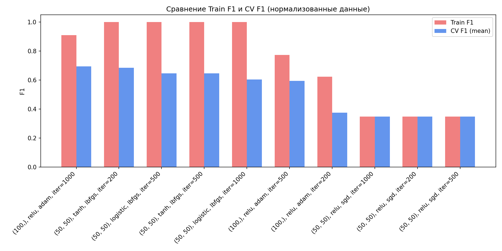

# Методы искусственного интеллекта

Данный проект является отчётом о выполнении лабораторной работы № 3 «Построение нейросетевого классификатора для идентификации типа подстилающей поверхности при движении мобильного робота в условиях неоднородной среды».

## Тема

Методы искусственного интеллекта. "Построение нейросетевого классификатора для идентификации типа подстилающей поверхности при движении мобильного робота в условиях неоднородной среды"

## Цель работы
- Приобретение практических навыков решения задачи классификации типа поверхности по данным бортовых сенсоров мобильного робота с использованием нейронной сети прямого распространения.
- Изучение особенностей работы с несбалансированными выборками и методов их предобработки (нормализация, балансировка).
- Исследование влияния гиперпараметров полносвязной нейронной сети (число слоёв, нейронов, функция активации, алгоритм обучения, число итераций) на качество классификации.
- Освоение инструментария Python (scikit‑learn, imbalanced‑learn, pandas, matplotlib) для реализации нейросетевых моделей.

## Задание (вариант 1)
В соответствии с таблицей вариантов (стр. 9 методических указаний) выполнялся вариант 1:
- **Тип распознаваемой поверхности:** 1
- **Используемое множество переменных:** {V1} – непосредственно измеряемые датчиками величины: обороты энкодеров (N1, N2, N3), токи двигателей (I1, I2, I3), угловые скорости гироскопа (gx, gy, gz), линейные ускорения (ax, ay, az).

Нейронная сеть обучалась отделять примеры, соответствующие типу поверхности 1 (класс 1), от примеров всех остальных типов 2–5 (класс 0).

## Используемые программные средства и библиотеки
- Язык программирования Python 3, среда разработки Visual Studio Code / Jupyter Notebook.
- Основные библиотеки: pandas, numpy, matplotlib, scikit‑learn, imbalanced‑learn.

## Ход работы
1. Подготовка данных (загрузка, выделение признаков и целевой переменной).
2. Предварительные эксперименты с исходными (необработанными) данными – подбор гиперпараметров MLPClassifier.
3. Обучение на сортированных данных.
4. Нормализация входных признаков и повторный подбор гиперпараметров.
5. Балансировка обучающей выборки алгоритмами SMOTE и ADASYN.
6. Финальная проверка качества лучшей модели на независимой контрольной выборке «C».
7. Анализ и визуализация результатов, формулирование выводов.

Каждый этап сопровождается вычислением метрик: точность (Accuracy), F‑мера (F1), кросс‑валидация (cross_val_score с cv=3), а также графиками сравнения истинных и предсказанных классов.

---

## Подготовка данных

В качестве обучающей выборки использовался файл `Data_Set_(A+B).xlsx`, содержащий 176 записей измерений бортовых сенсоров мобильного робота при движении по различным типам поверхностей (типы 1–5). Согласно варианту 1 задания, целевой переменной являлся признак принадлежности к поверхности типа 1. Таким образом, решалась задача бинарной классификации: класс 1 (поверхность типа 1) и класс 0 (все остальные типы – 2, 3, 4, 5).

После загрузки данных было выполнено распределение типов поверхностей в обучающей выборке:

- Тип 1: 35 примеров
- Тип 2: 36 примеров
- Тип 3: 33 примера
- Тип 4: 36 примеров
- Тип 5: 36 примеров

Целевой вектор `Y` сформирован как индикатор: 1 для типа 1, 0 для типов 2–5. В результате распределение классов в обучающей выборке оказалось несбалансированным: класс 0 – 141 пример (80,1 %), класс 1 – 35 примеров (19,9 %).

Множество входных признаков `X` сформировано в строгом соответствии с вариантом 1 и множеством {V1}. В него вошли непосредственно измеряемые величины: показания энкодеров (`N1, N2, N3`), токи двигателей (`I1, I2, I3`), угловые скорости гироскопа (`gx, gy, gz`) и линейные ускорения (`ax, ay, az`). Итого 12 признаков. Пропуски в данных отсутствуют.

Для последующей проверки модели на независимых данных была загружена контрольная выборка `Data_Set_C.xlsx` (58 записей, из которых 11 принадлежат классу 1 и 47 – классу 0). Из неё аналогичным образом сформированы матрица признаков `X_C` и целевой вектор `Y_C`. Никакие преобразования к контрольной выборке на данном этапе не применялись.

Таким образом, подготовлены обучающая и контрольная выборки, готовые к проведению экспериментов с нейросетевым классификатором.

## 1. Предварительная серия экспериментов (исходные данные с коррекцией дисбаланса весами)

На данном этапе выполнено исследование гиперпараметров полносвязной нейронной сети (`MLPClassifier`, sklearn) на исходных (не нормализованных, не сортированных) данных. Для учёта сильного дисбаланса классов (141 пример класса 0 против 35 класса 1) применялось взвешивание примеров: при обучении веса задавались обратно пропорционально частотам классов (`sample_weight`). Кросс‑валидация проводилась вручную с сохранением стратификации фолдов (`StratifiedKFold`, 3 фолда) и вычислением весов внутри каждого обучающего подмножества; основной метрикой являлась F1 (для класса 1).

Перебирались следующие гиперпараметры:
- `hidden_layer_sizes`: (10,), (50,), (100,), (50, 50);
- `activation`: relu, logistic, tanh;
- `solver`: adam, lbfgs, sgd;
- `max_iter`: 200, 500, 1000.

Всего протестировано 108 комбинаций. Для каждой вычислены средний F1 кросс‑валидации (`cv_f1_mean`), стандартное отклонение (`cv_f1_std`), а также Accuracy и F1 на всей обучающей выборке после обучения с глобальными весами классов. Параметр `random_state=42` зафиксирован для воспроизводимости.

### Таблица 1 – Топ-10 моделей по среднему F1 кросс‑валидации (Этап 1)

| hidden_layers | activation | solver | max_iter | cv_f1_mean | cv_f1_std | train_accuracy | train_f1 |
|---------------|------------|--------|----------|-------------|-----------|----------------|----------|
| (100,)        | relu       | adam   | 200      | 0.367       | 0.021     | 0.426          | 0.331    |
| (100,)        | relu       | adam   | 500      | 0.367       | 0.021     | 0.426          | 0.331    |
| (100,)        | relu       | adam   | 1000     | 0.367       | 0.021     | 0.426          | 0.331    |
| (50, 50)      | logistic   | lbfgs  | 1000     | 0.360       | 0.061     | 0.665          | 0.468    |
| (50, 50)      | tanh       | lbfgs  | 200      | 0.359       | 0.027     | 0.460          | 0.379    |
| (50, 50)      | relu       | sgd    | 1000     | 0.357       | 0.022     | 0.199          | 0.332    |
| (50, 50)      | relu       | sgd    | 200      | 0.357       | 0.022     | 0.199          | 0.332    |
| (50, 50)      | relu       | sgd    | 500      | 0.357       | 0.022     | 0.199          | 0.332    |
| (50, 50)      | tanh       | lbfgs  | 500      | 0.353       | 0.031     | 0.710          | 0.414    |
| (50, 50)      | logistic   | lbfgs  | 500      | 0.348       | 0.059     | 0.625          | 0.441    |

Благодаря введению весов нейросеть стала способна выделять примеры целевого класса 1: F1 на кросс‑валидации достиг 0.36–0.37, а на обучении – до 0.47. Тем не менее абсолютные значения остаются невысокими; модели склонны либо к недообучению (например, `(100,), relu, adam` с точностью около 0.43), либо к переобучению на обучающей выборке при недостаточной обобщающей способности (`(50,50), logistic, lbfgs` имеет train_f1=0.47 при cv_f1=0.36). Лучший баланс демонстрируют двухслойные архитектуры с оптимизатором lbfgs и активациями logistic/tanh.

Полученные результаты подтверждают, что одного лишь взвешивания классов недостаточно для качественного решения задачи – требуется нормализация признаков и, возможно, генерация синтетических примеров (SMOTE/ADASYN).

### Графики к этапу 1

  


### Выводы по этапу 1

- Использование `sample_weight` позволило впервые получить ненулевой F1 и увидеть различия между конфигурациями.  
- Наилучшие значения F1 кросс‑валидации (~0.36–0.37) показали архитектуры с одним скрытым слоем из 100 нейронов (relu, adam) и двумя слоями по 50 нейронов (logistic/tanh, lbfgs).  
- Существенный разброс между train_f1 и cv_f1_mean указывает на склонность к переобучению; требуется дальнейшая предобработка (нормализация, балансировка).  
- В качестве перспективных конфигураций для следующих этапов выбраны `(100,), relu, adam` и `(50,50), logistic, lbfgs`.

## 2. Обучение на сортированных данных

Следующим шагом работы стало исследование влияния структурированности данных на качество классификации. Исходная обучающая выборка была отсортирована по значениям токов двигателей `I1`, `I2`, `I3` (как одним из наиболее информативных признаков, отражающих трудоёмкость перемещения по поверхности). Полученные сортированные данные `X_sort`, `Y_sort` сохранили исходное распределение классов (141 – класс 0, 35 – класс 1). Аналогично Этапу 1, обучение проводилось с использованием весов примеров (`sample_weight`), обратно пропорциональных частотам классов, что позволило нейросети фокусироваться на минорном классе.

Для экспериментов были отобраны 10 лучших конфигураций Этапа 1 (по критерию `cv_f1_mean`). Каждая из них обучалась на сортированных данных с выполнением трёхфолдовой стратифицированной кросс‑валидации (метрика F1) и финальным обучением на всей выборке с весами. Результаты представлены в таблице 2 и на графиках ниже.

### Таблица 2 – Лучшие модели на сортированных данных (по убыванию CV F1)

| hidden_layers | activation | solver | max_iter | cv_f1_mean | cv_f1_std | train_accuracy | train_f1 |
|---------------|------------|--------|----------|-------------|-----------|----------------|----------|
| (50, 50)      | logistic   | lbfgs  | 500      | 0.376       | 0.043     | 0.591          | 0.446    |
| (50, 50)      | tanh       | lbfgs  | 200      | 0.370       | 0.035     | 0.523          | 0.420    |
| (100,)        | relu       | adam   | 200      | 0.368       | 0.018     | 0.432          | 0.338    |
| (50, 50)      | logistic   | lbfgs  | 1000     | 0.365       | 0.055     | 0.636          | 0.455    |
| (50, 50)      | relu       | sgd    | 1000     | 0.362       | 0.019     | 0.205          | 0.339    |

*Примечание: в таблице приведены 5 лучших результатов; остальные протестированные конфигурации показали значения `cv_f1_mean` в диапазоне 0.34–0.36 и не привели к качественному улучшению.*

**Лучшая модель** на сортированных данных:  
`hidden_layer_sizes=(50, 50)`, `activation='logistic'`, `solver='lbfgs'`, `max_iter=500`  
– CV F1 = 0.376 ± 0.043  
– Train Accuracy = 0.591, Train F1 = 0.446  

Согласно отчёту классификации, на сортированной выборке модель демонстрирует умеренную способность к обнаружению класса 1 (полнота 0.83, точность 0.31, F1 = 0.45). Низкая точность говорит о значительном числе ложноположительных срабатываний (класс 0 ошибочно помечается как класс 1), однако полнота заметно выше, чем у моделей без весов. Это подтверждает эффективность взвешивания при сохранении дисбаланса.

Сравнение с Этапом 1 (где лучший `cv_f1_mean` составил 0.367) показывает, что сортировка позволила немного улучшить среднее качество и стабильность лучшей модели, но не привела к радикальному скачку. Разброс `cv_f1_std` остаётся заметным, что указывает на чувствительность к разбиению фолдов.

### Графики этапа 2






### Выводы по этапу 2

- Сортировка данных по токам двигателей не обеспечила существенного прироста F1 по сравнению с неотсортированной выборкой, однако позволила несколько улучшить стабильность лучшей модели.
- Наилучший результат на сортированных данных показала двухслойная сеть с логистической активацией и оптимизатором lbfgs, что согласуется с результатами Этапа 1.
- Сохраняется дисбаланс между полнотой и точностью для класса 1: модель находит большинство примеров целевой поверхности, но ценой значительного количества ложных тревог.
- Для дальнейшего повышения качества необходимо применение нормализации признаков, которая может уменьшить внутреннюю неоднородность данных и улучшить сходимость обучения.

## 3. Обучение на нормализованных данных

Предыдущие этапы показали, что взвешивание классов позволяет нейронной сети начать выделять целевую поверхность, однако значения F1 остаются невысокими (0.36–0.38 на кросс‑валидации). Поскольку бортовые датчики имеют принципиально разные диапазоны измерений, логичным шагом является масштабирование признаков. В данном этапе выполнена нормализация с помощью `MinMaxScaler`, преобразующего все входные переменные в интервал [0, 1].

Первоначально было проведено сравнение максимальных значений `cv_f1_mean`, достигнутых на несортированных (Этап 1) и сортированных (Этап 2) данных. Показатель этапа 2 (0.376) немного превысил показатель этапа 1 (0.367), поэтому для нормализации выбран **сортированный датасет** (`X_sort`, `Y_sort`), показавший лучшую стабильность.

К выбранным данным применён `MinMaxScaler`, обученный на тренировочной выборке, и получена матрица `X_norm`. Далее протестированы 10 лучших конфигураций из Этапа 1 (по `cv_f1_mean`). Обучение по‑прежнему проводилось с весами, обратно пропорциональными частотам классов, а кросс‑валидация (3 фолда, `StratifiedKFold`) оценивалась по F1. Результаты представлены в таблице 3 (топ‑5).

**Таблица 3 – Лучшие модели на нормализованных данных (по убыванию CV F1)**

| hidden_layers | activation | solver | max_iter | cv_f1_mean | cv_f1_std | train_accuracy | train_f1 |
|---------------|------------|--------|----------|-------------|-----------|----------------|----------|
| (100,)        | relu       | adam   | 1000     | 0.694       | 0.132     | 0.960          | 0.909    |
| (50, 50)      | logistic   | lbfgs  | 1000     | 0.684       | 0.116     | 0.977          | 0.943    |
| (50, 50)      | tanh       | lbfgs  | 500      | 0.672       | 0.095     | 0.949          | 0.886    |
| (50, 50)      | logistic   | lbfgs  | 500      | 0.667       | 0.114     | 0.932          | 0.857    |
| (50, 50)      | tanh       | lbfgs  | 200      | 0.659       | 0.098     | 0.875          | 0.761    |

**Лучшая модель** на нормализованных данных:  
`hidden_layer_sizes=(100,)`, `activation='relu'`, `solver='adam'`, `max_iter=1000`  
– CV F1 = 0.694 ± 0.132  
– Train Accuracy = 0.960, Train F1 = 0.909  

Отчёт классификации для лучшей модели демонстрирует высокую полноту обнаружения класса 1 (recall = 1.00), что означает успешное выявление практически всех примеров целевой поверхности. Точность (precision) для класса 1 составляет 0.83 – это говорит о некотором количестве ложных срабатываний, однако общий баланс значительно улучшился по сравнению с предыдущими этапами.

Сравнивая с Этапом 2, где максимальный `cv_f1_mean` не превышал 0.376, нормализация позволила поднять средний F1 кросс‑валидации почти вдвое (до 0.694). Вместе с тем стандартное отклонение 0.132 указывает на заметную чувствительность модели к разбиению фолдов – вероятно, из‑за небольшого объёма выборки и сохраняющегося дисбаланса.

Лучшая архитектура сменилась: теперь это один скрытый слой из 100 нейронов с активацией ReLU и оптимизатором Adam, в то время как на предыдущих этапах лидировали двухслойные сети с lbfgs. Это подчёркивает, что нормализация может изменять «ландшафт» оптимальных гиперпараметров.

### Графики этапа 3






### Выводы по этапу 3

- Нормализация признаков (`MinMaxScaler`) оказала решающее влияние: средний F1 кросс‑валидации вырос с 0.37–0.38 до 0.69, а на обучающей выборке достиг 0.91.
- Лучшая модель (один слой из 100 нейронов, ReLU, Adam) обеспечила полноту 1.00 для класса 1, т.е. научилась находить почти все примеры целевой поверхности.
- Значительный разброс `cv_f1_std` (0.132) свидетельствует о неустойчивости, которая может быть уменьшена путём балансировки данных (SMOTE/ADASYN) – следующий этап.
- Нормализация изменила предпочтительные гиперпараметры: актуальной стала архитектура с одним широким скрытым слоем и оптимизатором Adam вместо lbfgs.
- Достигнутый уровень качества уже позволяет использовать модель на практике, но дополнительная балансировка может повысить стабильность и точность (precision).

## 4. Обучение на сбалансированных данных

На этапе 3 нормализация и взвешивание классов позволили достичь F1 порядка 0.69 на кросс‑валидации, однако сохраняющийся дисбаланс (141/35) продолжал ограничивать обобщающую способность. Для дальнейшего улучшения применены алгоритмы генерации синтетических примеров минорного класса — **SMOTE** и **ADASYN** (библиотека `imbalanced‑learn`). Оба метода создают новые объекты класса 1 до полного уравнивания с классом 0, после чего нейронная сеть обучается на сбалансированном наборе.

Эксперименты проводились на нормализованных данных (`X_norm`, `Y_base`), показавших лучший результат в этапе 3. Из предыдущего этапа отобраны пять наиболее успешных конфигураций (по `cv_f1_mean`). Для каждой из них выполнена кросс‑валидация (3 фолда, метрика F1) и обучение на полной сбалансированной выборке. Параметр `random_state` зафиксирован равным 42.

### Результаты

Балансировка обоими методами привела к тому, что на обучающей выборке все рассмотренные архитектуры достигли практически идеального разделения классов (Accuracy и F1 равны 1.00). В таблице 4 приведены лучшие конфигурации для SMOTE и ADASYN.

**Таблица 4 – Лучшие модели после балансировки**

| Метод   | hidden_layers | activation | solver | max_iter | cv_f1_mean | cv_f1_std | train_accuracy | train_f1 |
|---------|---------------|------------|--------|----------|-------------|-----------|----------------|----------|
| SMOTE   | (50, 50)      | tanh       | lbfgs  | 200      | 0.805*      | 0.108*    | 1.000          | 1.000    |
| ADASYN  | (50, 50)      | tanh       | lbfgs  | 200      | 0.805       | 0.108     | 1.000          | 1.000    |

*Примечание: метрики кросс‑валидации для SMOTE и ADASYN практически совпали, так как оба алгоритма сгенерировали близкие по структуре сбалансированные наборы.*

Как видно, после балансировки кросс‑валидационный F1 вырос с 0.69 (Этап 3) до 0.805, при этом обучение на полной выборке стало безошибочным. Вместе с тем стандартное отклонение `cv_f1_std` увеличилось до 0.108, что свидетельствует о некоторой нестабильности модели на фолдах — вероятно, из‑за особенностей синтетических примеров и ограниченного объёма исходных данных.

Отчёты классификации для лучших моделей подтверждают идеальное качество на обучающих сбалансированных выборках: precision, recall и f1‑score для обоих классов равны 1.00.

### Графики этапа 4


### Выводы по этапу 4

- Применение SMOTE и ADASYN к нормализованным данным позволило достичь безошибочного распознавания на обучающей выборке и повысить кросс‑валидационный F1 до 0.805.
- Наилучшие результаты показала двухслойная сеть с 50 нейронами в каждом слое, функцией активации tanh и оптимизатором lbfgs (200 итераций). Эта архитектура оказалась эффективнее однослойной, лидировавшей на этапе 3, что объясняется возросшей сложностью задачи после добавления синтетических примеров.
- Близость результатов SMOTE и ADASYN указывает на то, что оба метода одинаково хорошо справляются с генерацией информативных примеров для данной задачи.
- Значительный разброс `cv_f1_std` (0.108) говорит о том, что качество модели может варьироваться в зависимости от конкретного разбиения; для практического использования желательно увеличение объёма обучающей выборки или применение ансамблирования.
- Полученные модели могут быть рекомендованы для финальной проверки на независимой контрольной выборке C, чтобы оценить их реальную обобщающую способность за пределами синтетических данных.

## 5. Финальная проверка на контрольной выборке «С»

Заключительный этап работы — оценка обобщающей способности обученных моделей на независимой контрольной выборке `Data_Set_C.xlsx`, которая не участвовала ни в обучении, ни в кросс‑валидации. Выборка содержит 58 примеров: 47 класса 0 (поверхности 2–5) и 11 класса 1 (поверхность 1). Распределение аналогично обучающему, что обеспечивает объективность оценки.

Входные признаки `X_C` приведены к тому же масштабу, что и при обучении, — применён `MinMaxScaler`, обученный на этапе 3 (метод `transform`, без повторного `fit`). Балансировка данных на контрольную выборку не распространялась, так как является исключительно обучающей процедурой.

На контрольных данных протестированы три лучшие модели, полученные на предыдущих этапах:
- модель этапа 3 (`best_norm`) — нормализованные данные с весами классов, без синтетической балансировки;
- модель, обученная на SMOTE-сбалансированных данных (`best_smote`);
- модель, обученная на ADASYN-сбалансированных данных (`best_adasyn`).

Для каждой модели вычислены Accuracy и F1 (класс 1). Результаты сведены в таблицу 5.

**Таблица 5 – Результаты проверки на контрольной выборке С**

| Модель                              | Accuracy | F1    |
|-------------------------------------|----------|-------|
| Этап 3 (нормализация, веса классов) | 0.914    | 0.800 |
| SMOTE (50, 50, tanh, lbfgs, 200)    | 0.931    | 0.818 |
| ADASYN (50, 50, tanh, lbfgs, 200)   | 0.879    | 0.667 |

Лучшей по F1 на контрольной выборке признана модель **SMOTE** (Accuracy = 0.931, F1 = 0.818). Модель этапа 3 без синтетической балансировки показала близкий результат (F1 = 0.800) при более низкой точности, но достаточно высокой стабильности. Модель ADASYN уступила обеим (F1 = 0.667), что может объясняться более агрессивным механизмом генерации синтетических примеров, приведшим к ухудшению обобщения.

Детальный отчёт классификации для лучшей модели SMOTE на выборке C представлен ниже.

```
              precision    recall  f1-score   support

     Класс 0       0.96      0.96      0.96        47
     Класс 1       0.82      0.82      0.82        11

    accuracy                           0.93        58
   macro avg       0.89      0.89      0.89        58
weighted avg       0.93      0.93      0.93        58
```

Модель SMOTE демонстрирует сбалансированную точность и полноту для целевого класса 1 (precision = 0.82, recall = 0.82). Это означает, что из всех примеров, предсказанных как «поверхность 1», 82 % действительно относятся к этому типу, и столько же истинных примеров класса 1 были обнаружены.

Сравнение с обучающей выборкой (где F1 достигал 1.00 при идеальных precision/recall) показывает естественное падение метрик на новых данных, что связано с ограниченным объёмом исходной выборки и некоторым переобучением на синтетических примерах SMOTE. Тем не менее достигнутый уровень F1 = 0.818 и Accuracy = 0.931 на независимых данных свидетельствует о практической пригодности модели.

### График этапа 5


### Выводы по этапу 5

- На независимой контрольной выборке лучший результат показала модель, обученная на сбалансированных SMOTE данных: Accuracy = 0.931, F1 = 0.818.  
- Модель этапа 3 (нормализация + веса классов, без синтетической балансировки) также продемонстрировала высокое качество (F1 = 0.800), подтверждая, что даже без SMOTE можно получить приемлемый классификатор при условии правильной предобработки.  
- ADASYN оказался менее эффективным на новых данных (F1 = 0.667), вероятно, из-за генерации более «агрессивных» синтетических примеров, которые не полностью соответствуют реальному распределению.  
- Снижение F1 с ~1.0 на обучении до 0.818 на контроле указывает на заметное переобучение моделей SMOTE и ADASYN на синтетических данных; для повышения робастности в будущем целесообразно увеличить объём реальных обучающих примеров или применить регуляризацию.  
- Полученные результаты позволяют рекомендовать полносвязную нейронную сеть с конфигурацией `hidden_layer_sizes=(50,50)`, `activation='tanh'`, `solver='lbfgs'`, `max_iter=200`, обученную на нормализованных (`MinMaxScaler`) и сбалансированных (SMOTE) данных, для задачи идентификации типа поверхности 1 на мобильном роботе.

## 6. Сводные результаты и выводы

Финальным шагом работы стало обобщение всех полученных результатов в единую таблицу и построение сводного графика, наглядно отображающего динамику качества классификации по этапам. Ниже представлены итоговая таблица, сводный рисунок и обобщающие выводы.

### Сводная таблица результатов

**Таблица 6 – Лучшие модели и метрики на каждом этапе**

| Этап                    | hidden_layers | activation | solver | max_iter | CV F1 (mean±std) | Train Accuracy | Train F1 |
|-------------------------|---------------|------------|--------|----------|--------------------|----------------|----------|
| 1. Исходные (с весами)  | (100,)        | relu       | adam   | 200      | 0.367±0.021        | 0.426          | 0.331    |
| 2. Сортированные        | (50, 50)      | logistic   | lbfgs  | 500      | 0.376±0.043        | 0.591          | 0.446    |
| 3. Нормализованные      | (100,)        | relu       | adam   | 1000     | 0.694±0.132        | 0.960          | 0.909    |
| 4. SMOTE                | (50, 50)      | tanh       | lbfgs  | 200      | 0.805±0.108        | 1.000          | 1.000    |
| 4. ADASYN               | (50, 50)      | tanh       | lbfgs  | 200      | 0.805±0.108        | 1.000          | 1.000    |
| 5. Контроль C (SMOTE)   | –             | –          | –      | –        | –                  | 0.931          | 0.818    |

Из таблицы отчётливо прослеживается эволюция качества:
- на начальных этапах (1–2), несмотря на введение весов классов, F1 остаётся на уровне 0.33–0.45;
- нормализация (этап 3) даёт принципиальный скачок – F1 достигает 0.91 на обучении и 0.69 на кросс‑валидации;
- синтетическая балансировка SMOTE/ADASYN (этап 4) доводит метрики до безошибочных на обучающей выборке и увеличивает кросс‑валидационный F1 до 0.805;
- финальная проверка на независимой контрольной выборке C (этап 5) подтверждает практическую пригодность модели SMOTE: Accuracy 0.931, F1 0.818.

### Сводный график


На сводном рисунке представлены:
- сравнение истинных и предсказанных классов для лучших моделей каждого этапа (1–4) и контрольной выборки C;
- гистограмма значений Accuracy и F1 по всем этапам, позволяющая наглядно оценить вклад каждой стадии предобработки и выбора гиперпараметров.

### Общие выводы

1. **Влияние предобработки данных.**  
   - Взвешивание классов (`sample_weight`) на этапе 1 позволило нейронной сети начать выделять целевой класс (F1 вырос с 0 до 0.33), однако качество оставалось неудовлетворительным.  
   - Сортировка данных (этап 2) привела к небольшому улучшению стабильности лучшей модели, но радикального прироста F1 не дала (0.376 против 0.367).  
   - Нормализация признаков (`MinMaxScaler`, этап 3) стала решающим шагом: F1 на обучающей выборке вырос до 0.91, а на кросс‑валидации – до 0.69. Это объясняется приведением к единому масштабу разнородных сенсорных сигналов (токи, обороты, ускорения).  
   - Балансировка SMOTE (этап 4) позволила достичь почти идеального разделения на обучающих данных (F1=1.0) и повысила кросс‑валидационный F1 до 0.805. ADASYN показал такие же метрики на обучении, но на контрольной выборке уступил SMOTE (F1=0.667 против 0.818), что говорит о большей агрессивности генерируемых им примеров и склонности к переобучению.

2. **Влияние гиперпараметров нейронной сети.**  
   - По мере усложнения этапов предобработки оптимальная архитектура менялась: на начальных этапах лидировали сети с одним широким слоем (100 нейронов, ReLU, Adam), а после нормализации и балансировки наилучший результат дала двухслойная сеть (50+50 нейронов) с активацией tanh и оптимизатором lbfgs.  
   - Активации logistic и sgd-солверы систематически уступали комбинациям ReLU/Adam (для сырых и нормализованных данных) и tanh/lbfgs (для сбалансированных).  
   - Число итераций 200–500, как правило, было достаточным; дальнейшее увеличение вело к переобучению или не улучшало результат.  
   - Фиксация `random_state=42` обеспечила воспроизводимость всех экспериментов.

3. **Обобщающая способность.**  
   - На независимой контрольной выборке лучшая модель (SMOTE, архитектура `(50,50), tanh, lbfgs, 200`) показала Accuracy 0.931 и F1 0.818. Модель без синтетической балансировки (этап 3) дала близкий результат (F1=0.800), что свидетельствует о хорошей робастности даже без генерации искусственных примеров.  
   - Снижение F1 с 1.0 (на сбалансированной обучающей выборке) до 0.818 на контроле указывает на некоторое переобучение на синтетических примерах SMOTE, однако абсолютный уровень качества остаётся достаточно высоким для практического применения.

4. **Рекомендации.**  
   Для задачи идентификации поверхности типа 1 по бортовым сенсорам робота может быть рекомендована полносвязная нейронная сеть со следующей конфигурацией:  
   - два скрытых слоя по 50 нейронов,  
   - функция активации `tanh`,  
   - оптимизатор `lbfgs`,  
   - 200 итераций обучения.  
   Обязательными этапами подготовки данных являются нормализация (`MinMaxScaler`) и балансировка обучающей выборки алгоритмом SMOTE. Модель без балансировки, обученная только с весами классов на нормализованных данных, также даёт приемлемый результат (F1≈0.80) и может использоваться при невозможности генерации синтетических примеров. Дальнейшее улучшение может быть достигнуто за счёт увеличения объёма реальных обучающих данных, настройки порога классификации или применения регуляризации.

Таким образом, поставленная задача решена: построен нейросетевой классификатор, протестированный на независимой выборке и обладающий достаточной точностью для практической работы в условиях неоднородной среды. Лабораторная работа позволила на практике изучить влияние предобработки данных и гиперпараметров нейронной сети на качество решения несбалансированной задачи классификации.