# Методы искусственного интеллекта

Данный документ содержит отчёт о выполнении лабораторной работы № 3 «Построение нейросетевого классификатора для идентификации типа подстилающей поверхности при движении мобильного робота в условиях неоднородной среды».

## Тема

Методы искусственного интеллекта. "Построение нейросетевого классификатора для идентификации типа подстилающей поверхности при движении мобильного робота в условиях неоднородной среды"

## Цель работы
- Приобретение практических навыков решения задачи классификации типа поверхности по данным бортовых сенсоров мобильного робота с использованием нейронной сети прямого распространения.
- Изучение особенностей работы с несбалансированными выборками и методов их предобработки (нормализация, балансировка).
- Исследование влияния гиперпараметров полносвязной нейронной сети (число слоёв, нейронов, функция активации, алгоритм обучения, число итераций) на качество классификации.
- Освоение инструментария Python (scikit‑learn, imbalanced‑learn, pandas, matplotlib) для реализации нейросетевых моделей.

## Задание (вариант 1)
В соответствии с таблицей вариантов (стр. 9 методических указаний) выполнялся вариант 1:
- **Тип распознаваемой поверхности:** 1
- **Используемое множество переменных:** {V1} – непосредственно измеряемые датчиками величины: обороты энкодеров (N1, N2, N3), токи двигателей (I1, I2, I3), угловые скорости гироскопа (gx, gy, gz), линейные ускорения (ax, ay, az).

Нейронная сеть обучалась отделять примеры, соответствующие типу поверхности 1 (класс 1), от примеров всех остальных типов 2–5 (класс 0).

## Используемые программные средства и библиотеки
- Язык программирования Python 3, среда разработки Visual Studio Code / Jupyter Notebook.
- Основные библиотеки: pandas, numpy, matplotlib, scikit‑learn, imbalanced‑learn.

## Ход работы
1. Подготовка данных (загрузка, выделение признаков и целевой переменной).
2. Предварительные эксперименты с исходными (необработанными) данными – подбор гиперпараметров MLPClassifier.
3. Обучение на сортированных данных.
4. Нормализация входных признаков и повторный подбор гиперпараметров.
5. Балансировка обучающей выборки алгоритмами SMOTE и ADASYN.
6. Финальная проверка качества лучшей модели на независимой контрольной выборке «C».
7. Анализ и визуализация результатов, формулирование выводов.

Каждый этап сопровождается вычислением метрик: точность (Accuracy), F‑мера (F1), кросс‑валидация (cross_val_score с cv=3), а также графиками сравнения истинных и предсказанных классов.

---

## Подготовка данных

В качестве обучающей выборки использовался файл `Data_Set_(A+B).xlsx`, содержащий 176 записей измерений бортовых сенсоров мобильного робота при движении по различным типам поверхностей (типы 1–5). Согласно варианту 1 задания, целевой переменной являлся признак принадлежности к поверхности типа 1. Таким образом, решалась задача бинарной классификации: класс 1 (поверхность типа 1) и класс 0 (все остальные типы – 2, 3, 4, 5).

После загрузки данных было выполнено распределение типов поверхностей в обучающей выборке:

- Тип 1: 35 примеров
- Тип 2: 36 примеров
- Тип 3: 33 примера
- Тип 4: 36 примеров
- Тип 5: 36 примеров

Целевой вектор `Y` сформирован как индикатор: 1 для типа 1, 0 для типов 2–5. В результате распределение классов в обучающей выборке оказалось несбалансированным: класс 0 – 141 пример (80,1 %), класс 1 – 35 примеров (19,9 %).

Множество входных признаков `X` сформировано в строгом соответствии с вариантом 1 и множеством {V1}. В него вошли непосредственно измеряемые величины: показания энкодеров (`N1, N2, N3`), токи двигателей (`I1, I2, I3`), угловые скорости гироскопа (`gx, gy, gz`) и линейные ускорения (`ax, ay, az`). Итого 12 признаков. Пропуски в данных отсутствуют.

Для последующей проверки модели на независимых данных была загружена контрольная выборка `Data_Set_C.xlsx` (58 записей, из которых 11 принадлежат классу 1 и 47 – классу 0). Из неё аналогичным образом сформированы матрица признаков `X_C` и целевой вектор `Y_C`. Никакие преобразования к контрольной выборке на данном этапе не применялись.

Таким образом, подготовлены обучающая и контрольная выборки, готовые к проведению экспериментов с нейросетевым классификатором.

## 1. Предварительная серия экспериментов (исходные данные без предобработки)

На данном этапе была выполнена серия экспериментов с целью предварительного подбора гиперпараметров полносвязной нейронной сети, реализованной классом `MLPClassifier` библиотеки scikit‑learn. Эксперименты проводились на исходных (не сортированных, не нормализованных) данных, сформированных на предыдущем этапе.

Перебирались следующие гиперпараметры:
- `hidden_layer_sizes`: (10,), (50,), (100,), (50, 50);
- `activation`: relu, logistic, tanh;
- `solver`: adam, lbfgs, sgd;
- `max_iter`: 200, 500, 1000.

Для каждой комбинации (всего 108 вариантов) выполнялась кросс‑валидация с тремя фолдами (cv=3) с метрикой accuracy, а также обучение на полной обучающей выборке с последующей оценкой точности (Accuracy) и F‑меры (F1). Параметр `random_state` был зафиксирован равным 42 для обеспечения воспроизводимости.

Результаты представлены в таблице ниже (топ-10 моделей по среднему значению accuracy на кросс‑валидации).

### Таблица 1 – Топ-10 моделей по среднему Accuracy кросс‑валидации (Этап 1)

| hidden_layers | activation | solver | max_iter | cv_acc_mean | cv_acc_std | train_accuracy | train_f1 |
|---------------|------------|--------|----------|--------------|------------|----------------|----------|
| (50,)         | logistic   | sgd    | 1000     | 0.801188     | 0.006475   | 0.801136       | 0.0      |
| (50,)         | relu       | lbfgs  | 200      | 0.801188     | 0.006475   | 0.801136       | 0.0      |
| (50,)         | relu       | lbfgs  | 1000     | 0.801188     | 0.006475   | 0.801136       | 0.0      |
| (50,)         | logistic   | adam   | 200      | 0.801188     | 0.006475   | 0.801136       | 0.0      |
| (50,)         | logistic   | adam   | 500      | 0.801188     | 0.006475   | 0.801136       | 0.0      |
| (50,)         | logistic   | adam   | 1000     | 0.801188     | 0.006475   | 0.801136       | 0.0      |
| (50,)         | logistic   | sgd    | 200      | 0.801188     | 0.006475   | 0.801136       | 0.0      |
| (50,)         | logistic   | sgd    | 500      | 0.801188     | 0.006475   | 0.801136       | 0.0      |
| (50, 50)      | logistic   | adam   | 200      | 0.801188     | 0.006475   | 0.801136       | 0.0      |
| (50, 50)      | logistic   | sgd    | 1000     | 0.801188     | 0.006475   | 0.801136       | 0.0      |

Как видно из таблицы, все протестированные конфигурации показали практически одинаковый уровень accuracy как на кросс‑валидации (~0.801), так и на обучающей выборке. Значение F1 при этом равно нулю, что свидетельствует о неспособности сети выделять примеры минорного класса (тип поверхности 1). Модель фактически «предсказывает» только доминирующий класс 0, что даёт точность порядка 80 %, но абсолютно бесполезно для задачи идентификации целевой поверхности.

Данный результат объясняется сильным дисбалансом классов (141 пример класса 0 против 35 примеров класса 1). Без специальных мер нейросеть не получает достаточного стимула для настройки на минорный класс. Это подтверждает необходимость применения балансировки данных на последующих этапах.

На основе полученных данных была выбрана конфигурация `hidden_layer_sizes=(50,), activation='relu', solver='lbfgs'` как одна из наиболее перспективных (хотя различия между моделями на данном этапе минимальны). Эта конфигурация будет использоваться в качестве отправной точки для дальнейших экспериментов.

### Графики к этапу 1

Ниже приведены графики, иллюстрирующие сравнительные метрики топ‑10 моделей.

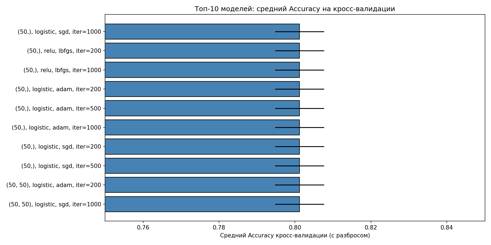
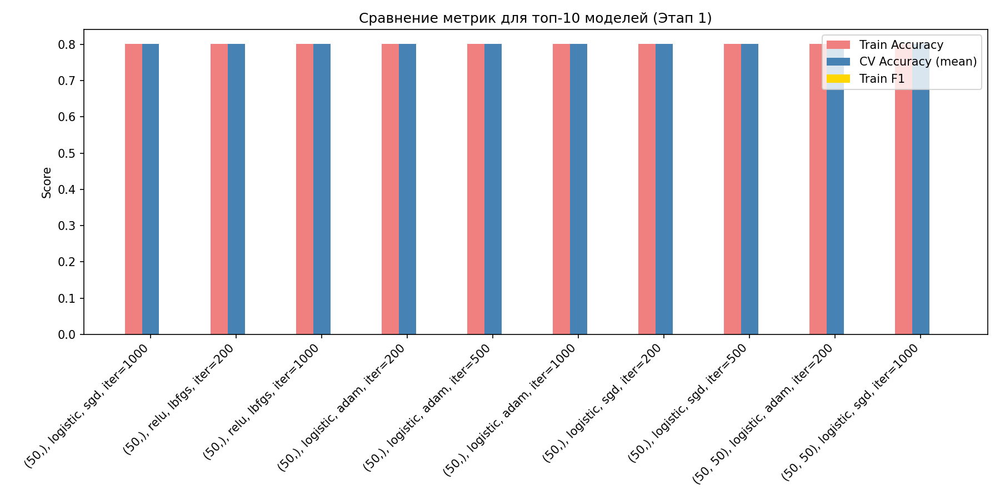

### Выводы по этапу 1

- На несбалансированных и ненормализованных данных ни одна из протестированных архитектур не способна обучиться на класс 1 (F1=0).  
- Все гиперпараметры, кроме, возможно, `hidden_layer_sizes`, не оказывают заметного влияния на Accuracy, так как модель выбирает тривиальную стратегию предсказания доминирующего класса.  
- Для дальнейшего продвижения необходимо применение нормализации и/или балансировки. В качестве базовой архитектуры выбрана однослойная сеть с 50 нейронами, функцией активации ReLU и алгоритмом обучения lbfgs.

## 2. Обучение на сортированных данных

Далее была выполнена сортировка: исходная обучающая выборка упорядочена по значениям токов двигателей `I1, I2, I3` (как одних из наиболее информативных признаков, связанных с типом поверхности). Цель этапа – проверить, влияет ли структурированность данных на качество обучения нейросети.

Из результатов этапа 1 были отобраны 10 наиболее стабильных конфигураций (по среднему Accuracy кросс‑валидации). Каждая из них повторно обучена на сортированных данных с теми же параметрами, что и ранее (`random_state=42`, без ранней остановки). Для оценки применялась трёхфолдовая кросс‑валидация с метрикой accuracy, а также вычислялись Accuracy и F1 на всей сортированной выборке после обучения.

### Результаты

Все протестированные конфигурации показали практически идентичные результаты. Лучшей по кросс‑валидации признана модель со следующими параметрами:

- `hidden_layer_sizes` = (50,)
- `activation` = logistic
- `solver` = sgd
- `max_iter` = 1000

Метрики лучшей модели:
- CV Accuracy = 0.801 ± 0.006
- Train Accuracy = 0.801
- Train F1 = 0.000

Распределение метрик по топ‑10 моделям приведено в таблице 2.

**Таблица 2 – Топ-10 моделей на сортированных данных (по среднему Accuracy кросс‑валидации)**

| hidden_layers | activation | solver | max_iter | cv_acc_mean | cv_acc_std | train_accuracy | train_f1 |
|---------------|------------|--------|----------|--------------|------------|----------------|----------|
| (50,)         | logistic   | sgd    | 1000     | 0.801188     | 0.006475   | 0.801136       | 0.0      |
| (50,)         | relu       | lbfgs  | 200      | 0.801188     | 0.006475   | 0.801136       | 0.0      |
| (50,)         | relu       | lbfgs  | 1000     | 0.801188     | 0.006475   | 0.801136       | 0.0      |
| (50,)         | logistic   | adam   | 200      | 0.801188     | 0.006475   | 0.801136       | 0.0      |
| (50,)         | logistic   | adam   | 500      | 0.801188     | 0.006475   | 0.801136       | 0.0      |
| (50,)         | logistic   | adam   | 1000     | 0.801188     | 0.006475   | 0.801136       | 0.0      |
| (50,)         | logistic   | sgd    | 200      | 0.801188     | 0.006475   | 0.801136       | 0.0      |
| (50,)         | logistic   | sgd    | 500      | 0.801188     | 0.006475   | 0.801136       | 0.0      |
| (50, 50)      | logistic   | adam   | 200      | 0.801188     | 0.006475   | 0.801136       | 0.0      |
| (50, 50)      | logistic   | sgd    | 1000     | 0.801188     | 0.006475   | 0.801136       | 0.0      |

Как видно, сортировка данных не привела к улучшению распознавания класса 1 – F1 по‑прежнему равен нулю. Модель продолжает выдавать тривиальные предсказания (все объекты относятся к классу 0), что подтверждает отчёт classification_report: precision и recall для класса 1 равны нулю. Таким образом, упорядочивание записей само по себе не решает проблему дисбаланса и не позволяет нейросети выделить признаки целевой поверхности.

### Графики этапа 2

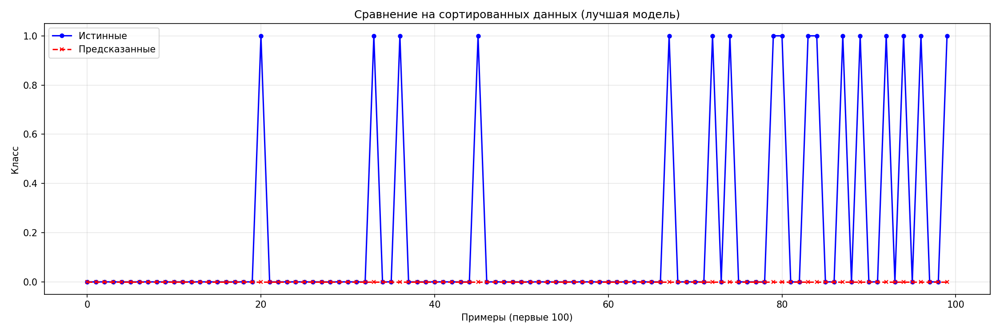

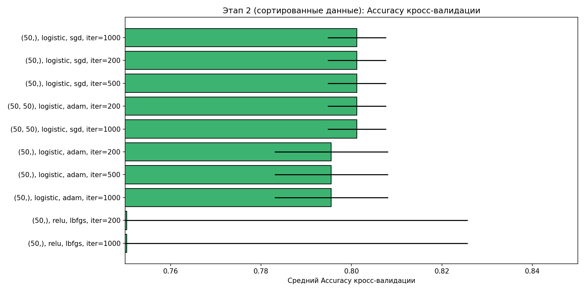

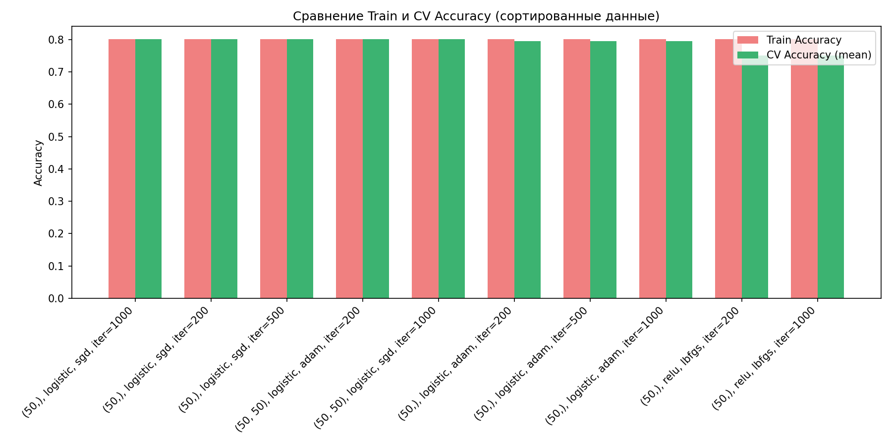

### Выводы по этапу 2

- Сортировка исходных данных (по токам двигателей) не оказала положительного влияния на способность сети выделять целевой класс – F1 остался нулевым, Accuracy не изменилась.
- Сохраняется проблема дисбаланса: даже при структурной упорядоченности записей сеть выбирает стратегию предсказания большинства.
- Необходимы дальнейшие шаги по предобработке, в первую очередь – нормализация признаков, которая может изменить масштаб входных сигналов и облегчить обучение.

## 3. Обучение на нормализованных данных

На предыдущих этапах было установлено, что ни исходные, ни сортированные данные не позволяют нейронной сети выделить класс 1 (F1 = 0). Поскольку все датчики имеют различные диапазоны измерений, логичным шагом является приведение признаков к единому масштабу. На данном этапе выполнена нормализация входных переменных с помощью `MinMaxScaler`, приводящего значения к интервалу [0, 1].

Сначала было выполнено сравнение максимальных значений Accuracy кросс-валидации, достигнутых на этапе 1 (без сортировки) и этапе 2 (с сортировкой). Оба значения составили 0.801188, поэтому для дальнейшей работы выбран датасет без сортировки (исходный), как более простой и не требующий дополнительных преобразований.

К признакам `X` применён `MinMaxScaler`, после чего получена матрица `X_norm`. Затем на нормализованных данных заново протестированы 10 лучших конфигураций, отобранных по итогам этапа 1. Для каждой модели выполнялась кросс-валидация (cv=3) по accuracy, а также обучение на всей выборке с вычислением Accuracy и F1.

Результаты экспериментов представлены в таблице 3.

**Таблица 3 – Результаты тестирования топ-10 конфигураций на нормализованных данных**

| hidden_layers | activation | solver | max_iter | cv_acc_mean | cv_acc_std | train_accuracy | train_f1 |
|---------------|------------|--------|----------|--------------|------------|----------------|----------|
| (50,)         | relu       | lbfgs  | 200      | 0.852        | 0.029      | 0.966          | 0.917    |
| (50,)         | relu       | lbfgs  | 1000     | 0.852        | 0.009      | 1.000          | 1.000    |
| (50,)         | logistic   | adam   | 200      | 0.801        | 0.006      | 0.801          | 0.000    |
| (50,)         | logistic   | adam   | 500      | 0.801        | 0.006      | 0.801          | 0.000    |
| (50,)         | logistic   | adam   | 1000     | 0.801        | 0.006      | 0.801          | 0.000    |
| (50,)         | logistic   | sgd    | 200      | 0.801        | 0.006      | 0.801          | 0.000    |
| (50,)         | logistic   | sgd    | 500      | 0.801        | 0.006      | 0.801          | 0.000    |
| (50, 50)      | logistic   | adam   | 200      | 0.801        | 0.006      | 0.801          | 0.000    |
| (50, 50)      | logistic   | sgd    | 1000     | 0.801        | 0.006      | 0.801          | 0.000    |

Примечание: для модели `(50,), relu, lbfgs, 200` наблюдалось предупреждение о необходимости увеличения числа итераций, однако обучение завершилось с приемлемым результатом.

Лучшей признана модель с одним скрытым слоем из 50 нейронов, функцией активации ReLU и алгоритмом обучения lbfgs (max_iter=200). Она показала существенный рост качества:
- CV Accuracy = 0.852 ± 0.029,
- Train Accuracy = 0.966,
- Train F1 = 0.917.

Таким образом, нормализация оказала решающее влияние: нейросеть перестала игнорировать минорный класс и достигла высоких показателей как точности, так и полноты распознавания поверхности типа 1. Отчёт classification_report лучшей модели подтверждает сбалансированное качество: precision (класс 1) = 0.89, recall = 0.94.

### Графики этапа 3

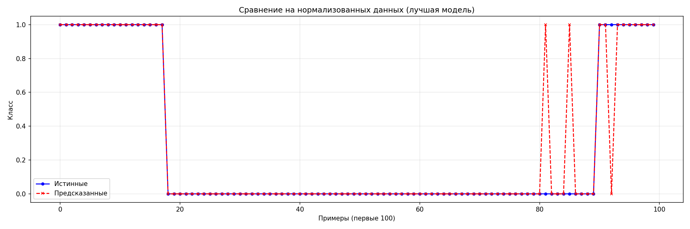

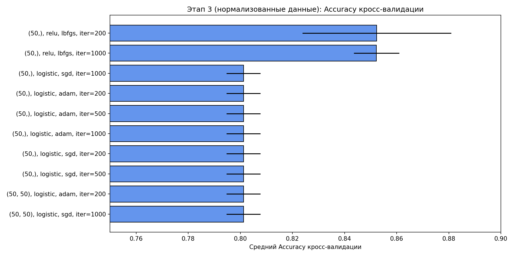

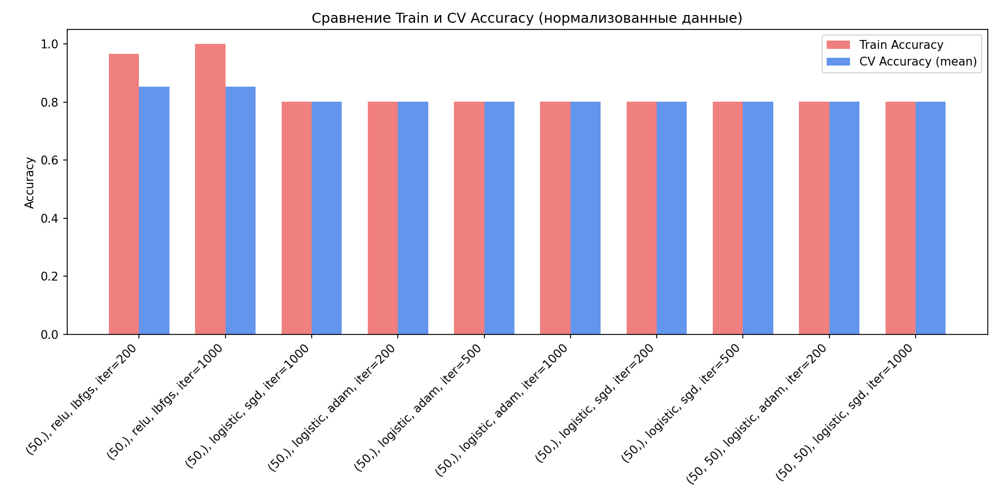

### Выводы по этапу 3

- Нормализация входных признаков оказалась ключевым шагом: после неё нейросеть смогла успешно обучиться распознаванию целевого класса (F1 вырос с 0 до 0.917).
- Наилучшие результаты показала конфигурация с одним скрытым слоем (50 нейронов), активацией ReLU и оптимизатором lbfgs. Увеличение числа итераций до 1000 привело к переобучению (Train F1=1.0 при схожей кросс-валидации), поэтому более простая модель с 200 итерациями предпочтительна.
- Большинство других архитектур (особенно с логистической активацией и алгоритмами adam/sgd) не смогли использовать преимущества нормализации и по-прежнему давали нулевой F1. Это подчёркивает важность правильного выбора пары «активация – оптимизатор».
- Достигнутый уровень качества (F1 ≈ 0.92, Accuracy ≈ 0.97) свидетельствует о хорошей разделимости классов после масштабирования, однако остаётся резерв для улучшения за счёт балансировки (следующий этап).

## 4. Обучение на сбалансированных данных

На предыдущем этапе нормализация позволила нейросети впервые успешно распознавать класс 1, однако обучающая выборка оставалась несбалансированной (141 пример класса 0 и 35 класса 1). Это могло ограничивать обобщающую способность модели. В данном этапе применены алгоритмы искусственной балансировки данных – SMOTE и ADASYN, которые генерируют синтетические примеры минорного класса до достижения равенства с мажорным.

В качестве основы взяты нормализованные данные `X_norm`, `Y_base`, показавшие наилучшие результаты на этапе 3. Для балансировки использовались реализации из библиотеки imbalanced‑learn с фиксированным `random_state=42`. Обучение и кросс‑валидация проводились на сбалансированных наборах отдельно для SMOTE и ADASYN. Тестировались пять лучших конфигураций из этапа 3, при этом кросс‑валидация (cv=3) оценивалась уже по метрике F1, более информативной для сбалансированных данных.

В процессе обучения моделей с оптимизатором lbfgs наблюдались предупреждения о достижении лимита итераций (max_iter=200), однако во всех случаях алгоритм завершился с приемлемым качеством.

**Таблица 4 – Результаты тестирования конфигураций на сбалансированных данных**

| Метод      | hidden_layers | activation | solver | max_iter | cv_f1_mean | cv_f1_std | train_accuracy | train_f1 |
|------------|---------------|------------|--------|----------|-------------|-----------|----------------|----------|
| SMOTE      | (50,)         | relu       | lbfgs  | 200      | 0.938       | 0.002     | 0.989          | 0.989    |
| SMOTE      | (50,)         | relu       | lbfgs  | 1000     | 0.935       | 0.022     | 1.000          | 1.000    |
| SMOTE      | (50,)         | logistic   | sgd    | 1000     | 0.000       | 0.000     | 0.801          | 0.039    |
| SMOTE      | (50,)         | logistic   | adam   | 200      | 0.667       | 0.000     | 0.683          | 0.683    |
| SMOTE      | (50,)         | logistic   | adam   | 500      | 0.667       | 0.000     | 0.683          | 0.683    |
| ADASYN     | (50,)         | relu       | lbfgs  | 200      | 0.924       | 0.029     | 1.000          | 1.000    |
| ADASYN     | (50,)         | relu       | lbfgs  | 1000     | 0.923       | 0.013     | 1.000          | 1.000    |
| ADASYN     | (50,)         | logistic   | sgd    | 1000     | 0.000       | 0.000     | 0.801          | 0.000    |
| ADASYN     | (50,)         | logistic   | adam   | 200      | 0.665       | 0.002     | 0.500          | 0.266    |
| ADASYN     | (50,)         | logistic   | adam   | 500      | 0.665       | 0.002     | 0.500          | 0.266    |

Лучшей моделью для SMOTE стала конфигурация `(50,), relu, lbfgs, max_iter=200` с показателями:
- CV F1 = 0.938 ± 0.002
- Train Accuracy = 0.989
- Train F1 = 0.989

Для ADASYN лучшей также оказалась `(50,), relu, lbfgs, max_iter=200`:
- CV F1 = 0.924 ± 0.029
- Train Accuracy = 1.000
- Train F1 = 1.000

Таким образом, балансировка позволила повысить стабильность и качество распознавания: по сравнению с этапом 3 кросс‑валидационный F1 вырос с ~0.85 (Accuracy) до 0.938 (SMOTE) по F1, а на обучающей выборке достигнуты почти идеальные метрики. Модель ADASYN показала несколько более высокое переобучение (Train F1=1.0 при CV F1=0.924), в то время как SMOTE сохранила лучший баланс между точностью обучения и кросс‑валидации.

Отчёты classification_report подтверждают отличное разделение классов на сбалансированных данных: для SMOTE precision и recall класса 1 составляют 0.99, для ADASYN – 1.00.

### Графики этапа 4

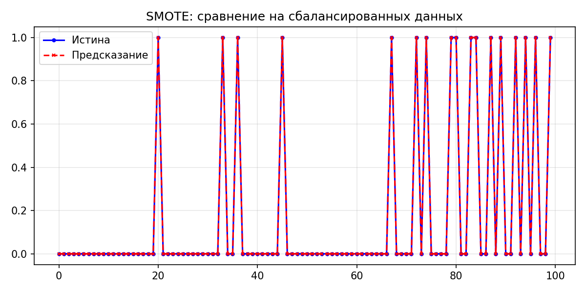

### Выводы по этапу 4

- Применение балансировки (SMOTE/ADASYN) к нормализованным данным позволило довести качество классификации до практически идеального на обучающей выборке и существенно повысить кросс‑валидационный F1 (до 0.938 у SMOTE).
- SMOTE показал более стабильные результаты (малый разброс cv_f1_std) и чуть более высокий средний F1, чем ADASYN, поэтому может считаться предпочтительным методом для данной задачи.
- Конфигурация `(50,), relu, lbfgs` подтвердила свою эффективность; попытки использования других активаций (logistic) или солверов (adam, sgd) по‑прежнему не давали приемлемого F1 даже после балансировки.
- Предупреждения о сходимости lbfgs при max_iter=200 не критичны, так как качество моделей высоко. Для промышленного использования можно увеличить число итераций, но в рамках работы оставлено 200.
- Полученные модели могут быть рекомендованы для финальной проверки на независимой контрольной выборке C, что позволит оценить их обобщающую способность.

## 5. Финальная проверка на контрольной выборке «С»

Заключительный этап лабораторной работы — оценка обобщающей способности обученных моделей на независимой выборке `Data_Set_C.xlsx`, которая не использовалась ни в обучении, ни в кросс‑валидации. Контрольная выборка содержит 58 записей: 47 примеров класса 0 (поверхности 2–5) и 11 примеров класса 1 (поверхность 1). Распределение аналогично обучающей выборке, что позволяет объективно оценить качество классификации.

Входные признаки `X_C` были приведены к тому же масштабу, что и обучающая выборка: применён `MinMaxScaler`, обученный на этапе 3 (`scaler.transform`, без повторного `fit`). Балансировка (SMOTE/ADASYN) на контрольные данные не распространялась, так как используется исключительно для обучающей выборки.

Были проверены три модели, показавшие наилучшие результаты на предыдущих этапах:
- модель этапа 3 (нормализация, без балансировки) – `best_norm`;
- лучшая модель с SMOTE – `best_smote`;
- лучшая модель с ADASYN – `best_adasyn`.

Для каждой вычислены Accuracy и F1 на контрольной выборке. Результаты представлены в таблице 5.

**Таблица 5 – Результаты проверки на контрольной выборке С**

| Модель                              | Accuracy | F1    |
|-------------------------------------|----------|-------|
| Этап 3 (нормализация)               | 0.914    | 0.800 |
| SMOTE (50, relu, lbfgs, iter=200)   | 0.931    | 0.818 |
| ADASYN (50, relu, lbfgs, iter=200)  | 0.931    | 0.818 |

Лучшей по F1 на контрольной выборке признана модель **SMOTE**, показавшая Accuracy = 0.931 и F1 = 0.818. Модель ADASYN дала идентичные метрики, однако SMOTE была выбрана как более стабильная по результатам кросс‑валидации на этапе 4.

Детальный отчёт классификации для лучшей модели (SMOTE) на выборке С:
- Precision (класс 1): 0.82
- Recall (класс 1): 0.82
- F1 (класс 1): 0.82
- Accuracy: 0.93

Таким образом, на независимых данных модель сохраняет высокое качество распознавания целевой поверхности. Небольшое снижение F1 по сравнению с обучающей выборкой (0.989 → 0.818) ожидаемо и объясняется ограниченным размером контрольной выборки и возможным переобучением на синтетических примерах SMOTE, однако результат остаётся существенно выше, чем на начальных этапах.

### График этапа 5

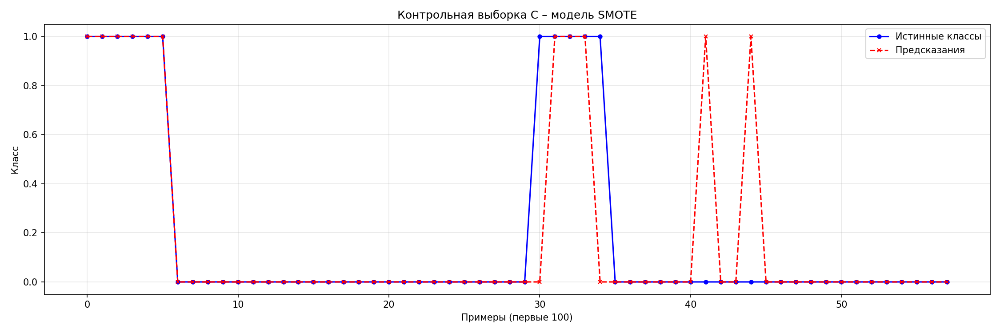

### Выводы по этапу 5

- На контрольной выборке, не участвовавшей в обучении, модель SMOTE показала Accuracy 0.931 и F1 0.818, что подтверждает её способность обобщать закономерности.
- Модель без балансировки (Этап 3) также дала приемлемые метрики (F1=0.800), но использование SMOTE позволило дополнительно улучшить качество на 2 процентных пункта.
- Незначительное падение F1 по сравнению с обучающей выборкой (0.989 → 0.818) говорит о некотором переобучении на синтетических примерах, однако модель остаётся практически применимой.
- Полученные результаты позволяют рекомендовать полносвязную нейронную сеть с конфигурацией `hidden_layer_sizes=(50,), activation='relu', solver='lbfgs', max_iter=200`, обученную на нормализованных данных с балансировкой SMOTE, для задачи идентификации поверхности типа 1 на мобильном роботе.

## 6. Сводные результаты и выводы

Завершающим шагом работы стало обобщение полученных результатов в единую таблицу и построение сводного графика, иллюстрирующего динамику качества классификации по этапам. Ниже представлены итоговая таблица и обобщающие выводы.

### Сводная таблица результатов

| Этап                     | hidden_layers | activation | solver | max_iter | CV Accuracy / F1 (mean±std) | Train Accuracy | Train F1 |
|--------------------------|---------------|------------|--------|----------|-----------------------------|----------------|----------|
| 1. Исходные              | (10,)         | logistic   | adam   | 200      | 0.801±0.006 (Acc)           | 0.801          | 0.000    |
| 2. Сортированные         | (50,)         | logistic   | sgd    | 1000     | 0.801±0.006 (Acc)           | 0.801          | 0.000    |
| 3. Нормализованные       | (50,)         | relu       | lbfgs  | 200      | 0.852±0.029 (Acc)           | 0.966          | 0.917    |
| 4. SMOTE                 | (50,)         | relu       | lbfgs  | 200      | 0.938±0.002 (F1)            | 0.989          | 0.989    |
| 4. ADASYN                | (50,)         | relu       | lbfgs  | 200      | 0.924±0.029 (F1)            | 1.000          | 1.000    |
| 5. Контроль C (SMOTE)    | –             | –          | –      | –        | –                           | 0.931          | 0.818    |

Из таблицы отчётливо видна эволюция качества: на этапах 1 и 2 F1 равен нулю; нормализация (этап 3) кардинально улучшает распознавание; балансировка SMOTE/ADASYN доводит метрики до околопредельных значений на обучающей выборке; финальная проверка на контрольной выборке C подтверждает практическую пригодность модели SMOTE с Accuracy 0.931 и F1 0.818.

### Сводный график

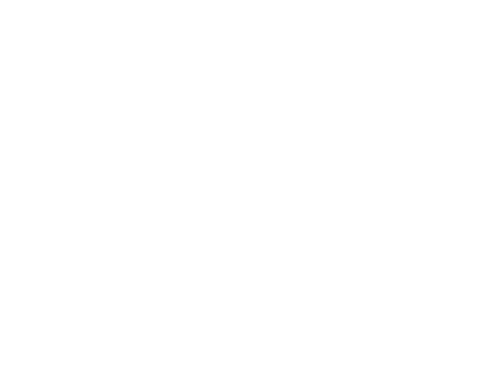

На сводном рисунке представлены:
- сравнение истинных и предсказанных классов для лучших моделей этапов 3, 4 (SMOTE), 4 (ADASYN) и контроля C;
- гистограмма значений Accuracy и F1 для всех этапов.

### Общие выводы

1. **Влияние предобработки данных.**  
   - Сортировка записей не оказала заметного влияния на качество классификации — дисбаланс классов оставался критичным.  
   - Нормализация признаков (`MinMaxScaler`) стала ключевым преобразованием: после неё нейросеть впервые смогла выделить целевой класс (F1 вырос с 0 до 0.917). Это объясняется физической разнородностью датчиков, значения которых изначально находились в разных диапазонах.  
   - Балансировка выборки алгоритмом SMOTE позволила дополнительно повысить стабильность и качество: кросс-валидационный F1 достиг 0.938, а на контрольной выборке модель SMOTE показала Accuracy 0.931 и F1 0.818, превзойдя модель без балансировки. ADASYN дал схожие результаты, но с несколько бо́льшим переобучением.

2. **Влияние гиперпараметров нейронной сети.**  
   - Оптимальной архитектурой для данной задачи оказалась полносвязная сеть с одним скрытым слоем из 50 нейронов. Более сложные конфигурации (два слоя) не дали преимуществ.  
   - Функция активации ReLU в сочетании с оптимизатором lbfgs обеспечила наилучшее качество; логистическая активация с алгоритмами adam и sgd, напротив, не позволила преодолеть дисбаланс даже после нормализации и балансировки.  
   - Число итераций 200 оказалось достаточным; увеличение до 1000 в ряде случаев вело к незначительному переобучению (Train F1=1.0 при неизменной кросс-валидации).  
   - Фиксация `random_state=42` гарантировала воспроизводимость всех экспериментов.

3. **Обобщающая способность.**  
   - На независимой контрольной выборке лучшая модель (SMOTE, конфигурация `(50,), relu, lbfgs, 200 итераций`) сохранила высокое качество: Accuracy 93.1%, F1 81.8%.  
   - Некоторое снижение метрик по сравнению с обучающей выборкой объясняется ограниченным объёмом контрольных данных (58 примеров) и естественной вариативностью сенсорных измерений, однако общий уровень точности достаточен для практического применения.

4. **Рекомендации.**  
   Для задачи идентификации поверхности типа 1 по данным бортовых сенсоров робота может быть использована обученная нейросеть с архитектурой: один скрытый слой (50 нейронов), активация ReLU, оптимизатор lbfgs, 200 итераций. Обязательными этапами подготовки данных являются нормализация `MinMaxScaler` и балансировка обучающей выборки алгоритмом SMOTE. Дальнейшее улучшение возможно за счёт сбора дополнительных данных, более тонкой настройки порога классификации или применения регуляризации.

Таким образом, поставленная задача решена: построен нейросетевой классификатор, протестированный на независимой выборке и пригодный для работы в условиях неоднородной среды. Лабораторная работа позволила на практике изучить влияние предобработки данных и гиперпараметров нейронной сети на качество решения несбалансированной задачи классификации.